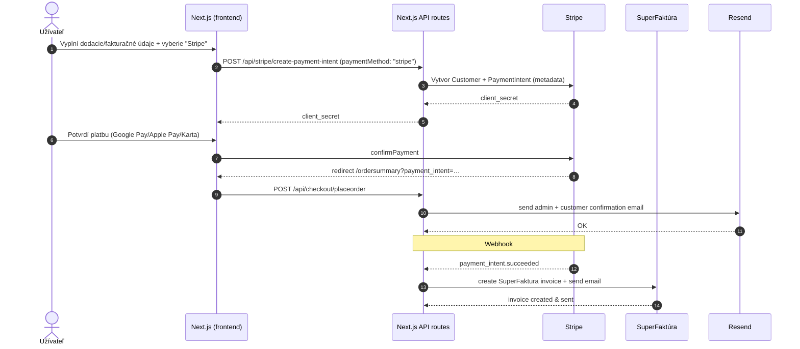
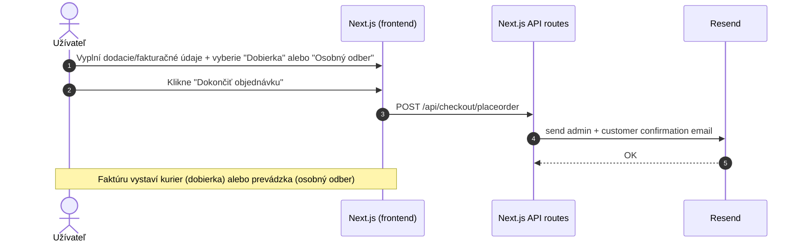

# Vino Putec - E-shop pre prémiové vína

## Optimalizácia obrázkov a odporúčaný spôsob ukladania

- Originálne (veľké) súbory ukladajte do priečinka `assets-src/` (mimo produkčného buildu). Zvážte Git LFS pri veľkých datasetoch.
- Do priečinka `public/` commitujte už len optimalizované verzie (zmenšené, recompressované).
- Spustite optimalizáciu lokálne pred PR/buildom:

```bash
npm run images:opt
```

- Konfigurácia Next Image je nastavená v `next.config.ts` (`deviceSizes`, `imageSizes`) a podporuje AVIF/WebP.
- Pri `<Image>` používajte `sizes` podľa layoutu (mobil-first), pre above-the-fold zvažujte `priority` a vhodný `fetchPriority`.

**Vino Putec** je moderný e-shop pre prémiové vína z rodinnej vinárne vo Vinosadoch. Postavený na Next.js 15, TypeScript, Tailwind CSS a Redux, optimalizovaný pre malé obchody s až 200 produktmi.

## Architektúra a štruktúra projektu (aktualizované 2025-09)

- Framework: Next.js App Router (15.x), TypeScript, TailwindCSS
- Stav: Redux Toolkit (košík, checkout stav)
- Úložisko produktov: JSON súbory v `configs/` (bez databázy)
- Platby: Stripe Payment Element + Webhook (fakturácia)
- Emaily: Resend + React Email (moderné email šablóny)
- Fakturácia: SuperFaktúra (právne platné faktúry s PDF prílohou)
- Hosting: Vercel (Node runtime pre webhook)

### Novinky (SEO, výkon, obsah)
- Výkon: optimalizované obrázky (`npm run images:optimize`), LCP/CLS fix (hero cez `next/image` s `priority`, `sizes`), lazy-load pod‑fold sekcií, `prefers-reduced-motion`.
- SEO: JSON‑LD pre `Organization`, `Winery (LocalBusiness)`, `WebSite`, `BreadcrumbList`, `ItemList`, `Product` (detail vína/degustácie) + canonical/OG.
- Interné prelinkovanie: posilnené odkazy na hlavné stránky `Degustácie` a `Ubytovanie` v menu, footeri, homepage a `o-nas`.
- UI dôveryhodnosť: rating badge (5.0/31) v hero a na kartách/detailoch.

### Strom adresárov (výber)
- `app/`
  - `page.tsx` – domovská stránka
  - `products/` a `vina/` – listing a detail produktov
  - `pokladna/` – checkout (Shipping/Billing, Stripe element)
  - `ordersummary/` – zhrnutie po platbe
  - `api/` – API routy (Stripe, newsletter, kontakty…)
    - `stripe/create-payment-intent` – vytvorenie PI + prenesenie metadát
    - `stripe/webhook` – vystavenie a odoslanie faktúry (finalize → send → paid)
    - `checkout/placeorder` – odoslanie e-mailov cez Resend
  - `degustacie/` – hlavná stránka degustácií
  - `ubytovanie/` – hlavná stránka ubytovania
- `configs/` – konfigurácie (wines.json, checkout.json, locale…)
- `public/` – obrázky (`/vina`, galérie, logá…)
- `store/` – Redux store, slices
- `docs/` – operatívny návod (`OPERATIONS.md`)

## Dátový model produktov (JSON)

- Zdroj pravdy: `configs/wines.json`
- Povinné polia: `Id`, `Name`, `Slug`, `RegularPrice`/`SalePrice`, `Currency`, `Image`, `Category`
- Obrázky: `public/vina/...` a v JSON sa referencujú cestou `/vina/xyz.jpg`

Pridanie produktu:
1. Nahraj obrázok do `public/vina/`
2. Pridaj záznam do `configs/wines.json`
3. Deploy (Vercel) – produkt sa zobrazí v liste a má detail cez `Slug`

## O nás

Putec s.r.o. je rodinná vinárňa s dlhoročnou tradíciou vo Vinosadoch, ktorá sa špecializuje na výrobu prémiových vín. Naša história sa začala s láskou k vinohradníctvu a túžbou vytvoriť vína, ktoré odrážajú jedinečnú chuť našej krajiny.

## Kontakt

- **Adresa**: Pezinská 154, 902 01 Vinosady, Slovensko
- **Telefón**: +421 911 250 400
- **Email**: info@vinoputec.sk
- **IČO**: 36658774
- **DIČ**: 2022219430
- **IČ DPH**: SK2022219430
- **IBAN**: SK08 7500 0000 0040 3035 3200

## Funkcie

- **Bez databázy** – Produkty sú uložené v JSON súboroch
- **Rýchly a ľahký** – Postavený na Next.js a optimalizovaný pre výkon
- **Košík a objednávka** – LocalStorage košík s Stripe a dobierkou
- **Newsletter integrácia** – Prihlásenie na newsletter
- **Kontaktný formulár s Google reCAPTCHA v3** – Ochrana pred spamom
- **Moderné email šablóny** – React Email komponenty s inline logo attachmentom
- **Spracovanie objednávok cez email** – Používa Resend na odosielanie notifikácií
- **Automatická fakturácia** – SuperFaktúra pre právne platné faktúry s PDF prílohou
- **SEO optimalizovaný** – Rýchle, indexovateľné stránky produktov
- **Nasadenie kdekoľvek** – Funguje na Vercel alebo akomkoľvek statickom hostingu

## Technológie

- **Frontend**: Next.js 15, TypeScript, Tailwind CSS, Redux Toolkit
- **Úložisko**: JSON-based súborový systém (bez databázy)
- **Platby**:
  - **Stripe Payment Element** – Online platby (Google Pay, Apple Pay, kreditné/debetné karty)
  - **Dobierka** – Platba kurierovi pri dodaní
  - **Osobný odber** – Platba na prevádzke vo Vinosadoch
- **Emaily**:
  - **Resend** – Odosielanie emailov
  - **React Email** – Moderné React komponenty pre email šablóny
  - **Inline attachments** – Logo priložené priamo v emailoch (cid:logo)
- **Fakturácia**:
  - **SuperFaktúra** – Automatické generovanie právne platných faktúr (len pri online platbe)
  - **PDF prílohy** – Faktúra automaticky priložená v zákazníckom emaile
- **Hosting**: Vercel

## Optimalizácia obrázkov (výkon a SEO)

- Používame `next/image` s optimalizáciou zapnutou v `next.config.ts` (formáty `AVIF`/`WebP`).
- Všetky obrázky v `public/` sú zmenšované in‑place skriptom (zachovaná logická štruktúra priečinkov):

Skripty:

```bash
# náhľad bez zmien (DRY RUN)
npm run images:dry

# ostrá optimalizácia (prepíše pôvodné súbory menšími a recompressnutými)
npm run images:optimize
```

Čo skript robí:
- obmedzí šírku veľkých fotiek na max 1600 px a recompressne podľa prípony:
  - JPEG → mozjpeg ~75
  - PNG → compressionLevel 9 + paleta
  - WebP/AVIF → primeraná kvalita
- logo `public/putec-logo.jpg` zmenšuje na 160 px pre malé použitie.
- DRY RUN: nastav `DRY_RUN=1` (používa `cross-env`) alebo `npm run images:dry`.

Poznámky k komponentom:
- `Hero` má `sizes="100vw"` a používa `fill`.
- Karty produktov používajú validné `width/height` + `sizes` pre responzívne načítanie.

Poznámka: odporúča sa spúšťať pred produkčným buildom, aby sa do buildu dostali už optimalizované assety.

## Next/Image konfigurácia
- Používa sa `images.remotePatterns` (namiesto deprecated `images.domains`) pre: `localhost`, `vino-putec-web.vercel.app`, `vinoputec.sk`.

## JSON‑LD schémy
- V `app/layout.tsx`: `Winery (LocalBusiness)`, `Organization`, `WebSite` + `aggregateRating` (5.0/31)
- Listingy (`/vina`, `/degustacie`): `BreadcrumbList`, `ItemList`
- Detaily (`/vina/[slug]`, `/degustacie/[slug]`): `Product` + `Offer` + `BreadcrumbList`

## Landingy a interné linky
- Landingy: `degustacie/pezinok`, `ubytovanie/vinosady`
- Menu a Footer doplnené o priame odkazy; homepage CTA smerujú na landingy
- `sitemap.ts` obsahuje nové cesty; po deploy požiadať o indexáciu v GSC

## React Email integrácia

### Email komponenty

Všetky emaily sú postavené na moderných React komponentoch v priečinku `app/emails/`:

- **OrderConfirmationAdmin.tsx** – Admin email pri novej objednávke
- **OrderConfirmationCustomer.tsx** – Zákaznícky email s potvrdením objednávky
- **DegustationReservationAdmin.tsx** – Admin email pri rezervácii degustácie
- **DegustationReservationCustomer.tsx** – Zákaznícky email s potvrdením rezervácie
- **NewsletterWelcome.tsx** – Uvítací email pre nových odberateľov newsletteru
- **ContactForm.tsx** – Email z kontaktného formulára

### Výhody React Email

- **Moderný vývoj** – Používame React komponenty namiesto HTML stringov
- **Type safety** – Plná TypeScript podpora pre všetky props
- **Konzistentný dizajn** – Všetky emaily majú jednotný vzhľad a feel
- **Lepšia údržba** – Komponentový prístup je čitateľnejší a ľahšie sa upravuje
- **Inline logo** – Logo je priložené priamo v emaile (cid:logo) pre spoľahlivé zobrazenie

### Email dizajn

- **Header**: Zlatý gradient s okrúhlym logom (80x80px)
- **Body**: Čisté rozloženie s info boxmi a tabuľkami
- **Footer**: Kontaktné informácie a social linky
- **Responzívny**: Optimalizovaný pre všetky email klienty

### Testované email klienty

✅ Gmail, Apple Mail, Outlook, Yahoo Mail, HEY, Superhuman

## Platobný proces a fakturácia

### Platobné metódy

1. **Stripe (Online platba)**
   - Google Pay, Apple Pay, kreditné/debetné karty
   - Okamžité spracovanie platby
   - Automatická SuperFaktúra faktúra odoslaná emailom

2. **Dobierka (Cash on Delivery)**
   - Platba kurierovi pri doručení
   - Bez online platby
   - Faktúru vystaví kurier

3. **Osobný odber**
   - Platba na prevádzke vo Vinosadoch
   - Bez online platby
   - Faktúru vystavia na prevádzke

### Emailová logika

- **Potvrdenie objednávky (Resend + React Email)** – Posielané **VŽDY** všetkým zákazníkom po úspešnej objednávke
  - Pekne formátovaný email s logom
  - Zoznam objednaných produktov
  - Dodacie a fakturačné údaje
  - Informácie o doprave a platbe
- **Faktúra (SuperFaktúra)** – Posielané **len pri online platbe** cez Stripe
  - PDF faktúra priložená priamo v zákazníckom emaile
  - Automatické označenie ako uhradené
- **Dobierka/osobný odber** – Faktúru vystavuje kurier alebo prevádzka neskôr

### Nákupný proces – sekvenčný diagram

#### Online platba (Stripe):


#### Dobierka / Osobný odber:


## Stripe integrácia (platobná brána)

- **Produkčná Webhook URL**: `https://vino-putec-web.vercel.app/api/stripe/webhook`
- **Primárny event**: `payment_intent.succeeded`
- **Podporované platobné metódy**: Google Pay, Apple Pay, kreditné/debetné karty
- **Lokalizácia**: `customer.preferred_locales: ['sk', 'sk-SK']`

### Aké údaje sa prenášajú do Stripe metadata
- `PaymentIntent.metadata` obsahuje:
  - `orderId`, `paymentMethod` (stripe/cod/pickup)
  - `item_{i}_title`, `item_{i}_qty`, `item_{i}_price_cents`
  - `shippingMethod`, `shippingPriceCents`
  - billing_* a shipping_* polia (meno, adresa, e‑mail)
  - firemné údaje: `billing_company_name`, `billing_company_ico`, `billing_company_dic`, `billing_company_icdph`

### Testovanie (lokálne)
```bash
stripe listen --forward-to localhost:3000/api/stripe/webhook
# nastav STRIPE_WEBHOOK_SECRET podľa výstupu listen
npm run dev
```
V logu uvidíš SuperFaktúra správy o vytvorení a odoslaní faktúry.

### Produkčný checklist
- [ ] `STRIPE_SECRET_KEY` v `.env` (Vercel Environment Variables)
- [ ] `STRIPE_PUBLISHABLE_KEY` v `.env` 
- [ ] `STRIPE_WEBHOOK_SECRET` pre webhook endpoint
- [ ] Webhook events: `payment_intent.succeeded`
- [ ] Test platba: Google Pay / Apple Pay / Karta → SuperFaktúra email

## SuperFaktúra integrácia - Primárny fakturačný systém

- **Automatická fakturácia**: Po úspešnej Stripe platbe sa vytvorí právne platná faktúra v SuperFaktúre
- **PDF príloha**: Faktúra sa automaticky stiahne ako PDF a priloží k zákazníckemu emailu
- **Podmienečné emailovanie**: Faktúra sa vytvorí a odošle **len pri online platbe** cez Stripe
- **Dobierka/osobný odber**: Faktúru netvoria automaticky (vystaví ju kurier/prevádzka)
- **Automatické označenie**: Faktúra je automaticky označená ako uhradená pri Stripe platbách
- **Environment premenné**: 
  - `SUPERFAKTURA_EMAIL` - Email pre API autentifikáciu
  - `SUPERFAKTURA_API_KEY` - API kľúč
  - `SUPERFAKTURA_COMPANY_ID` - ID firmy v SuperFaktúre
  - `SUPERFAKTURA_SANDBOX` - true/false pre sandbox/produkčný režim
- **Podporované meny**: EUR, CZK
- **DPH sadzba**: 20% (nastaviteľné v `app/utils/superFakturaApi.ts`)

### ✅ Overené funkcie:
- **Produkčná URL**: `https://moja.superfaktura.sk` (+ sandbox podpora)
- **API autentifikácia**: Funguje s produkčným aj sandbox kľúčom
- **Vytvorenie faktúry**: Úspešné vytvorenie s položkami + doprava
- **DPH kalkulácia**: 20% DPH správne vypočítané
- **Číslovanie faktúr**: Automatické
- **Email odosielanie**: SuperFaktúra + Resend (s PDF prílohou)
- **PDF príloha**: Faktúra automaticky stiahnutá a priložená k emailu
- **Označenie ako uhradené**: Automatické pri Stripe platbách
- **Firemné údaje**: IČO, DIČ, IČ DPH správne prenesené
- **Aktualizácia klientov**: Existujúci klienti sa aktualizujú s novými údajmi
- **Server-side idempotency**: Ochrana proti duplikátnym faktúram

### SuperFaktúra flow (len pri online platbe):
1. Zákazník zaplatí cez Stripe (Google Pay/Apple Pay/Karta)
2. Stripe webhook prijme `payment_intent.succeeded`
3. Kontrola `metadata.paymentMethod === 'stripe'`
4. SuperFaktúra vytvorí faktúru s položkami a dopravou
5. SuperFaktúra označí faktúru ako uhradenú
6. PDF faktúra sa stiahne z SuperFaktúry
7. Resend odošle potvrdenie objednávky s PDF faktúrou ako prílohou
8. Zákazník dostane jeden email s potvrdením a faktúrou

### Dokumentácia:
- Podrobný návod: `docs/SUPERFAKTURA_INTEGRATION.md`
- Testovanie: Lokálne cez Stripe CLI alebo produkčne na Vercel

## API prehľad

- `GET /api/wines` – načítanie produktov z `configs/wines.json`
- `POST /api/stripe/create-payment-intent` – vytvorenie PaymentIntent, uloženie metadát (položky košíka, doprava, billing/shipping, firemné údaje, paymentMethod)
- `POST /api/stripe/webhook` – prijíma `payment_intent.succeeded`, vytvára SuperFaktúra faktúru (len pri online platbe)
- `POST /api/checkout/placeorder` – odošle potvrdenie objednávky cez Resend (volá sa vždy)

## Checkout UX

- Platobné metódy sa aktivujú hneď po vyplnení dopravy (billing sa predvyplní ako shipping, ak nie je zvolené „iná fakturačná adresa")
- Podpora firmy (IČO/DIČ/IČ DPH) – prenášané do Stripe metadata a SuperFaktúra faktúry

## Správa produktov (vína)

### Aktuálny stav
- **31 aktívnych produktov**: 
  - **28 vín**: Cabernet Franc, Cabernet Sauvignon (Rosé, Frizzante), Müller Thurgau, Dunaj, Frankovka Modrá, Chardonnay, Muškát Žltý, Pálava, Pesecká Leánka, Rizling (Rýnsky, Vlašský, Battonage), Pinot (Blanc, Gris), Veltlínske Zelené, Tramín Červený, Váh
  - **3 špeciálne sety**: Jarné Osvieženie, Parížske Zlato, Ročník 2023
- **Úložisko**: `configs/wines.json`
- **Obrázky**: `public/vina/` (optimalizované)
- **Kategórie**: Biele, Červené, Ružové, Perlivé, Suché, Polosuché, Polosladké, Sladké, Akcia, Výpredaj, Ocenené vína, Špeciálne Sety, Darčeky

### Ocenené vína
- **Cabernet Sauvignon Rosé 2024**: Zlatá medaila Paris Vinalies 2025
- **Chardonnay 2023**: Zlatá medaila Paris Vinalies 2024
- **Muškát Žltý 2020**: Zlatá medaila Grand Prix VINEX

### Ako pridať nové víno

1. **Nahrajte obrázok**
   ```bash
   # Skopírujte obrázok vína do:
   public/vina/nazov-vina-2024.jpg
   
   # Spustite optimalizáciu obrázkov:
   npm run images:optimize
   ```

2. **Pridajte položku do `configs/wines.json`**
   - Otvorte súbor `configs/wines.json`
   - Skopírujte existujúce víno ako šablónu
   - Upravte všetky polia:
     - `ID` - Unikátne ID (napr. "wine-032")
     - `Title` - Názov vína (napr. "Veltlínske zelené 2024")
     - `Slug` - URL slug (napr. "veltlinske-zelene-2024")
     - `ShortDescription` - Krátky popis (max 200 znakov)
     - `LongDescription` - Podrobný popis vína
     - `RegularPrice` - Bežná cena (napr. "12.90")
     - `SalePrice` - Akciová cena (rovnaká ako RegularPrice ak nie je akcia)
     - `FeatureImageURL` - Cesta k obrázku (napr. "/vina/veltlinske-zelene-2024.jpg")
     - `ProductCategories` - Kategórie (napr. ["Biele vína", "Suché vína"])
     - `WineDetails` - Všetky vinárske údaje (ročník, farba, chuť, aróma, alkohol, ...)

3. **Aktivujte víno**
   ```json
   "Enabled": true,
   "CatalogVisible": true
   ```

4. **Commit a deploy**
   ```bash
   git add .
   git commit -m "Pridané víno: Názov vína"
   git push
   ```
   Vercel automaticky nasadí zmeny na produkciu.

### Príklad štruktúry vína

Použite ktorékoľvek z existujúcich vín v `wines.json` (wine-001 až wine-028) ako predlohu. Všetky položky majú rovnakú štruktúru s detailnými vinárskymi údajmi.

### Poznámka o placeholder obrázkoch
Niektoré vína majú dočasné placeholder obrázky. Nahraďte ich skutočnými fotografiami vín:
- `cabernet-franc-2022.jpg`
- `muskat-zlty-2020.jpg`
- `tramin-cerveny-2023.jpg`
- `vah-2020.jpg`

## Nastavenie prostredia

- `.env.local` (lokálne), Vercel Env (produkcia)
- Kľúče (výber):
  - **Stripe**: 
    - `NEXT_PUBLIC_STRIPE_PUBLISHABLE_KEY` – verejný kľúč (test/live)
    - `STRIPE_SECRET_KEY` – tajný kľúč (test/live)
    - `STRIPE_WEBHOOK_SECRET` – webhook secret (test/live)
  - **Resend + React Email**:
    - `RESEND_API_KEY` – pre odosielanie emailov
    - `RESEND_FROM_EMAIL` – odosielateľská adresa
    - `ADMIN_EMAIL` – admin email pre notifikácie
  - **SuperFaktúra**:
    - `SUPERFAKTURA_EMAIL` – email pre API autentifikáciu
    - `SUPERFAKTURA_API_KEY` – API kľúč
    - `SUPERFAKTURA_COMPANY_ID` – ID firmy
    - `SUPERFAKTURA_SANDBOX` – true/false (sandbox/produkcia)

## Nasadenie (Vercel)

- Webhook route beží na Node runtime (nie edge): `export const runtime='nodejs'`
- Webhook endpoint v Stripe: `https://vino-putec.vercel.app/api/stripe/webhook`, event: `payment_intent.succeeded`
- Pre produkciu použi LIVE kľúče a LIVE webhook secret

## Prečo nevyužívame Stripe Products

- Zdroj pravdy ostáva v JSON (`configs/wines.json`) kvôli kontrole vizuálu, rýchlosti a jednoduchosti
- Jednoduchá správa produktov bez nutnosti synchro nizácie s external API
- V budúcnosti je možné doplniť paralelne Stripe Products/Prices pre reporting/Tax bez zmeny UI (voliteľné)

## Poznámky k implementácii

- **React Email komponenty**: Všetky emaily sú postavené na React komponentoch v `app/emails/`
- **Inline logo**: Logo je priložené ako inline attachment (cid:logo) pre spoľahlivé zobrazenie
- **Faktúry**: SuperFaktúra faktúry sa vytvoria len pri online platbe (Stripe), dobierka a osobný odber faktúru nevytvárajú
- **PDF prílohy**: PDF faktúra sa automaticky stiahne a priloží k zákazníckemu emailu
- **Emaily**: Resend odosiela potvrdenie objednávky vždy (s React Email šablónami)
- **Zber dát**: billing/shipping + firma/IČO/DIČ/IČ DPH → PI.metadata → SuperFaktúra faktúra
- **Idempotencia**: Server-side cache predchádza duplikátnym objednávkam a faktúram
- **Aktualizácia klientov**: SuperFaktúra aktualizuje existujúcich klientov s novými údajmi

## Spustenie

### Klonovanie repozitára
```sh
git clone https://github.com/Abra7abra7/vino-putec-web.git
cd vino-putec-web
```

### Inštalácia závislostí
```sh
npm install
```

### Konfigurácia

**/configs/products.json** - Obsahuje všetky údaje o produktoch pre váš obchod. Každý produkt obsahuje polia ako:
- ID, Názov, Slug, Krátky popis, Dlhý popis
- Bežná cena, Zľavová cena, Mena, Obrázok produktu
- Galéria obrázkov, Kategória, Typ predplatného, atď.

**/configs/locale.en.json** - Spravuje všetok lokalizovaný obsah pre rozhranie vášho obchodu vrátane:
- UI labely (tlačidlá, správy)
- Položky navigačného menu
- Footer a kontaktné informácie
- Sociálne médiá
- Obsah domovskej a o nás stránky

**/configs/checkout.json** - Definuje všetky nastavenia súvisiace s checkout skúsenosťou:
- Spôsoby dopravy: Názvy, ceny a meny
- Dostupné krajiny: Samostatné zoznamy pre krajiny dopravy a fakturácie
- Spôsoby platby: Zahŕňa Stripe a dobierku s možnosťami zapnúť/vypnúť

**/.env.local** – Ukladá citlivé premenné prostredia a konfiguráciu runtime pre váš obchod

### Nastavenie environment premenných
```sh
# Skopírujte príklad súboru
cp env.example .env.local

# Upravte .env.local s vašimi skutočnými API kľúčmi
# Všetky služby sú voliteľné - e-shop funguje aj bez nich
```

### Spustenie development servera
```sh
npm run dev
```

Potom otvorte http://localhost:3000 vo vašom prehliadači.

**Poznámka:** E-shop funguje aj bez nastavenia API kľúčov. Platobné metódy a newsletter budú dostupné až po nastavení príslušných služieb.

## Licencia

Vino Putec je vydaný pod MIT licenciou.

## Podpora

Ak nájdete tento projekt užitočný, zvážte podporu našej práce. Vaša podpora nám pomáha udržiavať tento projekt nažive a ďalej ho zlepšovať.

Ďakujeme! ❤️

---

### Administrátor: Operácie a podpora
- Podrobný operatívny návod pre Stripe a fakturáciu: `docs/OPERATIONS.md`